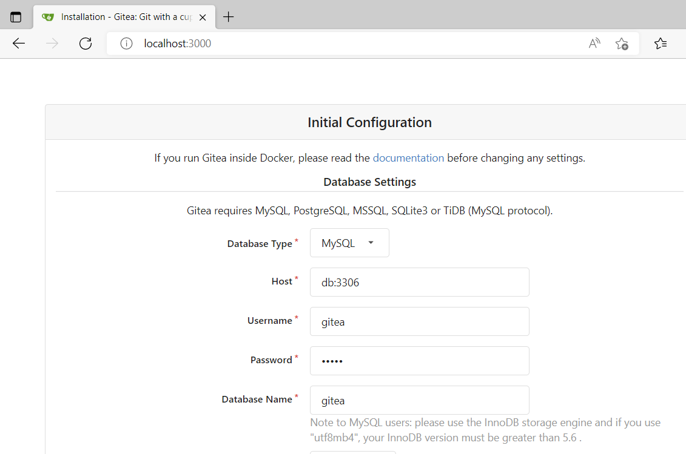
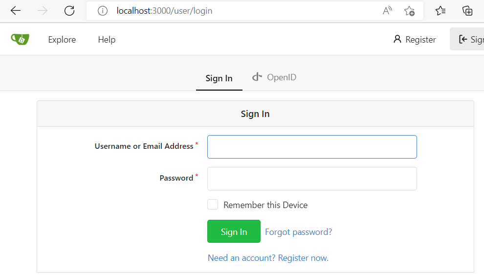
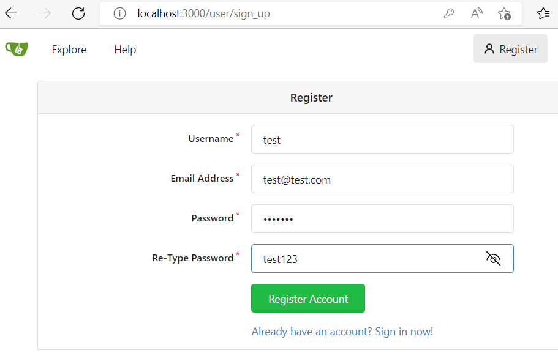
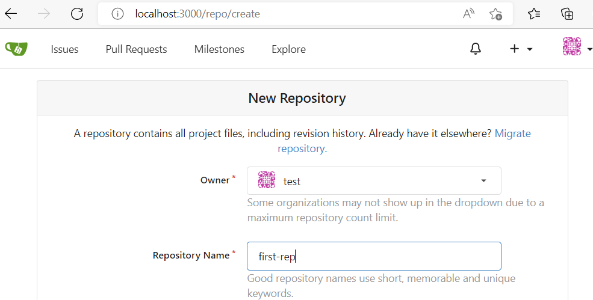
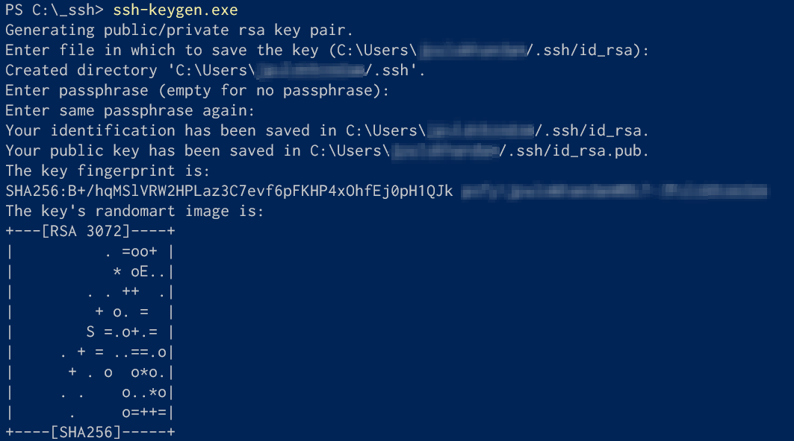
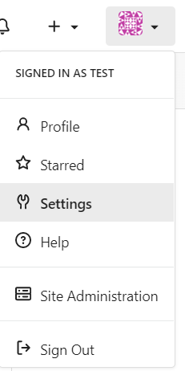
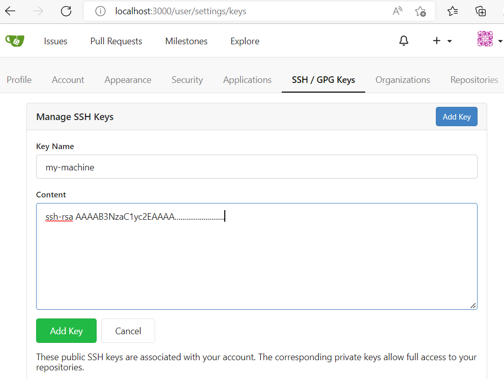
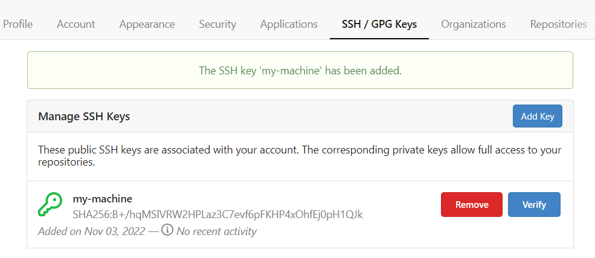
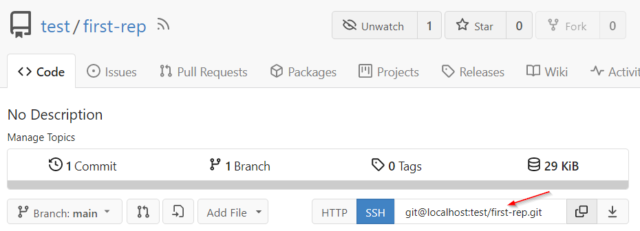
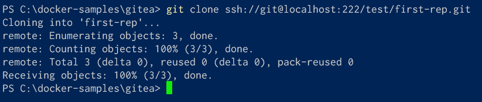

# Gitea Demo

This demonstrates on how we can privately host Git within docker on our machine. This demo is mainly for developers starting to learn "Git". This covers both HTTP and SSH way of interacting with Git.

NOTE:

- The docker-compose.yml is configured to work with Docker installation on Windows host only
- In order to work with Linux host (ex: Ubuntu, Mac etc.), we may need to provide USER_UID and USER_GID as explained at https://easycode.page/gitea-a-self-hosted-private-git-server-on-docker/

## Installation & Usage

- Use following command to start the docker container.

```bash
> start.bat
```

- open http://localhost:3000 in browser.
- The initial configuration would look like this



- If you are using windows, no changes are necessary. Scroll all the way down and click on the button "Install Gitea" to kick off Gitea.
- After few moments, we see the login page.



- Register new user as follows:



- Create a new repository as follows:



## HTTP based interaction

- Following basic commands in sequence would work to create a file and push to the git repo:

```bash
>git clone http://localhost:3000/test/first-rep
>cd .\first-rep\
>git status

using any editor create first-file.txt in the current folder

>git status
>git add .
>git status
>git commit -m "first test"
>git status
>git push http://test@localhost:3000/test/first-rep
```

## SSH based interaction

- If not already, generate SSH key on your local machine as follows:



or use a command as following:

```bash
ssh-keygen -o -t rsa -C "me@test.com"
```

- using a text editor open "C:\Users\<username>\.ssh\id_rsa.pub" and copy the entire content

- open profile settings



- Add a new key as follows:



- Once added it should show the confirmation as follows:



- Now grab the SSH url of the repository from the following:



- Use following command to clone the repository:

```bash
git clone ssh://git@localhost:222/test/first-rep.git
```

Notice the initial git clone with GitHub SSH on Windows complains about being unable to establish the host authenticity. That warning message is expected. Just type yes and allow the GitHub SSH clone operation to continue.



- Following basic commands in sequence would work to create a file and push to the git repo:

```bash
>cd .\first-rep\
>git status

create / modify files in current folder

>git status
>git add .
>git status
>git commit -m "modified set"
>git status
>git push
```

### SSH based helpful commands to try out

The following demonstrates on how to initialize a repository (on an existing folder) and push it to remote

```bash
git init
git add .
git commit -m "my set of changes"
git remote add origin ssh://git@localhost:222/test/second-rep.git
git push -u origin master
```

## Uninstall

- Press Ctrl+C to stop the docker container console
- Use following command to delete all containers, images, volumes, network bridges etc.

```bash
> cleanup.bat
```

- Finally, manually delete "gitea" and "mysql" folders created through docker-compose
